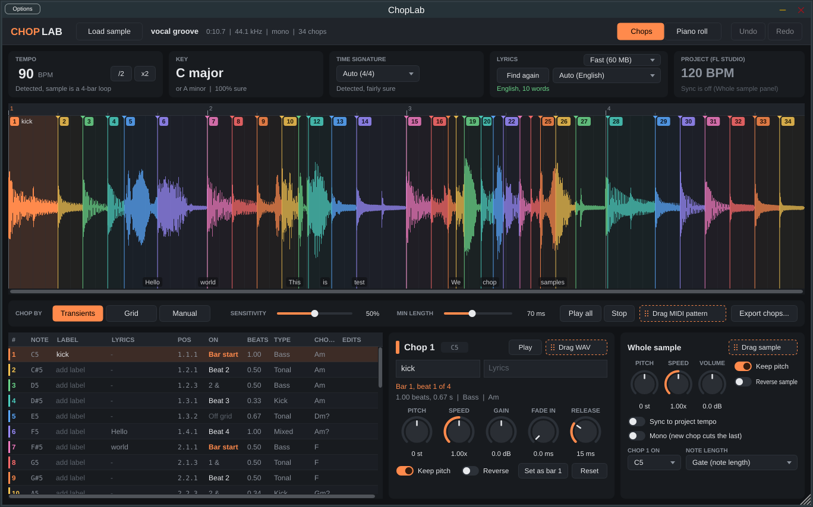
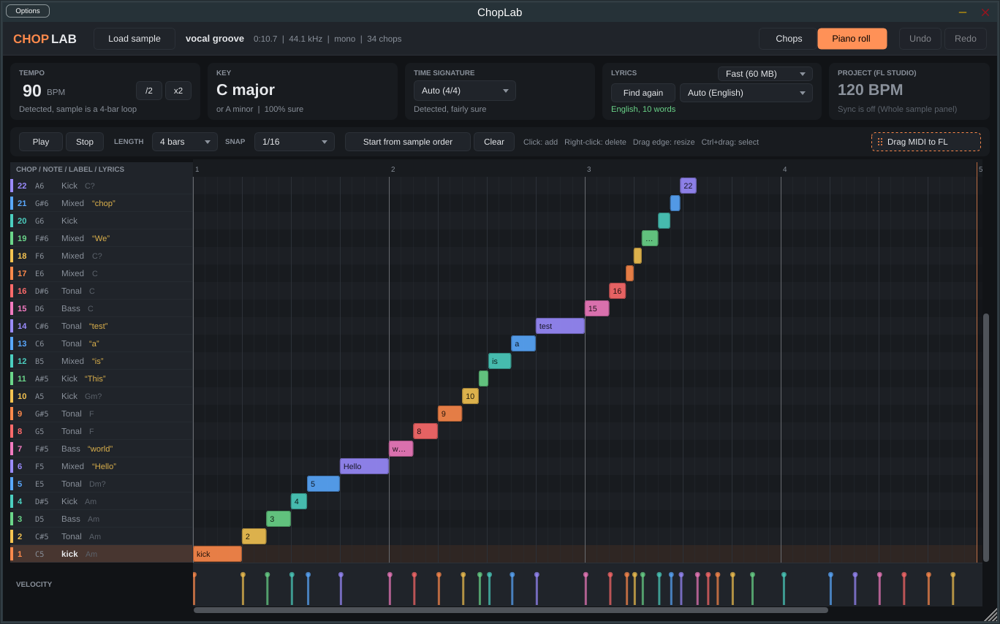

# ChopLab

A VST3 sample chopper for FL Studio (Windows). Drop a sample in and it:





- finds the **BPM** (exact for loops, x2 and /2 buttons for half/double-time mix-ups)
- finds the **key** (with a second guess and a confidence score, and says so when there isn't one, e.g. drum loops)
- finds the **time signature** (3/4 vs 4/4 automatically, anything else you can set)
- **chops it** at every hit, on a beat grid (bar, 1/4, 1/8, 1/16, triplets), or by hand
- tells you **where each chop lands**: bar, beat, and whether it's the start of a bar, on a beat, an "&", an "e"/"a" 16th, or off the grid
- tells you **what each chop is**: a rough type (kick, snare/clap, hi-hat, bass, tonal, mixed) and the chord or note in it
- lets you **label** every chop
- finds the **lyrics** and puts each word on the chop it's sung in (speech-to-text that runs offline on your PC, language detected automatically)
- has a **piano roll** where every row is a chop, labelled with its note, label and lyrics, so you build the pattern seeing what each key is, then drag it into FL
- **pitch, speed and reverse** per chop and for the whole sample, with speed either time-stretched (keeps pitch) or tape-style
- **syncs** the sample to your FL project tempo
- plays chop 1 on **C5**, chop 2 on C#5 and so on, so you play them from the piano roll
- lets you **drag** any chop, the processed sample, or a MIDI pattern of the original chop order straight into FL
- has undo/redo, and saves everything (including the audio) inside your FL project

## Install in FL Studio

1. Download `ChopLab-Windows-VST3` from the latest successful run on this repo's **Actions** tab and unzip it.
2. Copy the `ChopLab.vst3` folder to `C:\Program Files\Common Files\VST3\`.
3. In FL Studio: **Options > Manage plugins > Find installed plugins**. ChopLab shows up under Generators.
4. Add it to the Channel rack like any instrument.

## Using it

- **Load**: drag an audio file onto the plugin (WAV, AIFF, FLAC, MP3, OGG, up to 10 minutes), or click *Load sample*.
- **Play chops**: click a chop in the waveform or the list to hear it. In the piano roll, C5 is chop 1, C#5 is chop 2, and so on (set the start note under *Chop 1 on*).
- **Chop modes**:
  - *Transients*: a chop at every hit. *Sensitivity* sets how quiet a hit can be, *Min length* stops flams making tiny chops.
  - *Grid*: chops on the beat grid, counted from bar 1.
  - *Manual*: you place them.
- **Editing chops**: drag a marker to move it, double-click the waveform to add one (it snaps to the nearest hit; hold Shift to place it exactly), right-click to remove one or set bar 1. Alt-click a marker also removes it.
- **Labels**: double-click the Label cell in the list, or type in the box above the knobs.
- **Bar 1 is wrong?** Select the chop that should be bar 1 and click *Set as bar 1*, or right-click in the waveform.
- **Tempo is double or half?** Use x2 or /2. You can also double-click the number and type the tempo.
- **Drag into FL**: drag a chop out of the waveform or use *Drag WAV*; *Drag sample* gives the whole processed sample; *Drag MIDI pattern* gives a pattern that replays the chops in their original order. Files are saved in `Documents\ChopLab\<sample name>\`, and their names include any edits so an earlier drag never gets overwritten.
- **Note length**: *Gate* stops a chop when the note ends, *One-shot* always plays it through. *Mono* makes each chop cut off the previous one.
- **Lyrics**: click *Find lyrics* in the Lyrics card. The first time, it downloads the speech model once (Fast is about 60 MB, Accurate about 190 MB, saved in `%APPDATA%\ChopLab\Models`). Words show in the Lyrics column, on each chop, and under the waveform. The language is detected automatically; pick one from the list if it guesses wrong, then click *Find again*. Double-click a chop's lyrics to fix them; your edits are kept (shown brighter than detected words).
- **Piano roll** (the *Piano roll* tab at the top): each row is a chop, with its number, note, label or sound type, and lyrics. Click to add a note (it's as long as the chop), drag to move it (up and down changes the chop), drag its right edge to resize, right-click or right-drag to delete, Ctrl+drag to select, Ctrl+C / Ctrl+V to duplicate, arrow keys to nudge, Alt to ignore snap, Ctrl+wheel to zoom. Drag in the velocity lane to set velocities. *Play* (or Space) loops it at the project tempo. *Start from sample order* lays out every chop where it was in the sample, which is a good starting point for a flip. When it's right, use *Drag MIDI to FL* and drop it in FL's piano roll or playlist: the notes play the same chops on this channel.
- **Shortcuts** (when the plugin window has keyboard focus): Space plays the selected chop, Left/Right moves between chops, Delete merges a chop into the one before, Ctrl+Z / Ctrl+Y undo and redo. FL Studio grabs some keys for itself, and every shortcut also has a button.

## What to expect from the detection

It's good, not magic:

- **BPM** is exact on loops and tight on most produced music. Half/double-time is genuinely ambiguous (is it 72 or 144?), and so are songs with tempo changes. The x2 and /2 buttons fix the first case.
- **Key** works well on melodic material. It often can't tell a key from its relative (C major vs A minor), which is why it shows two guesses.
- **Time signature**: nobody's detector is reliable here. It picks between 3/4 and 4/4 and leans toward 4/4.
- **Chop type and chord** are hints from the spectrum. A chop of a full mix usually reads as "Mixed".
- **Lyrics** are good on clean vocals and acapellas, and get worse the busier the beat underneath is. For a vocal over a full mix, separate the vocal first with FL's stem separation and load the vocal stem. Sung, stretched or mumbled words trip it up more than spoken ones; *Accurate* helps. Word timing is usually within about a quarter of a second, so a word right on the edge of a chop can land on its neighbour; double-click to fix it.
- **Lyrics need a CPU from about 2013 or later** (AVX2). Older CPUs get a message instead.
- **Re-chopping** (changing mode, sensitivity or grid) replaces the chops, so labels and edits on chops that no longer exist are dropped. Undo brings them back. Piano roll notes stay on the same chop numbers, so after a re-chop they may point at different audio.
- **Copy/paste into FL's piano roll** isn't possible from a plugin (FL's clipboard is internal), which is why the piano roll uses drag and drop instead.

## Building from source

The **Actions** workflow builds and tests the Windows VST3 on every push. To build it yourself on Windows you need Visual Studio 2022 (Community is free, with the "Desktop development with C++" workload) and CMake:

```
cmake -B build -A x64
cmake --build build --config Release --target ChopLab_VST3
```

The plugin ends up in `build/ChopLab_artefacts/Release/VST3/ChopLab.vst3`. JUCE, Signalsmith Stretch and whisper.cpp are downloaded automatically during the first configure.

Tests:

```
cmake --build build --config Release --target ChopLabTests ChopLabHostTests ChopLabEngineTests
build/ChopLabTests_artefacts/Release/ChopLabTests            # analysis on synthetic loops with known answers
build/ChopLabTests_artefacts/Release/ChopLabTests --download-model 0
build/ChopLabTests_artefacts/Release/ChopLabTests --lyrics-test Tests/fixtures   # speech with known words and timing
build/ChopLabEngineTests_artefacts/Release/ChopLabEngineTests Tests/fixtures      # piano roll playback, undo, state, lyrics
build/ChopLabHostTests_artefacts/Release/ChopLabHostTests build/ChopLab_artefacts/Release/VST3/ChopLab.vst3
```

## Credits and licenses

- [JUCE](https://juce.com) plugin framework (AGPLv3, or JUCE's commercial licence, which has a free tier for small revenue)
- [Signalsmith Stretch](https://github.com/Signalsmith-Audio/signalsmith-stretch) for pitch shifting and time stretching (MIT)
- [whisper.cpp](https://github.com/ggml-org/whisper.cpp) for speech-to-text, with OpenAI's Whisper models (MIT)
- The BPM, key, time signature and transient detection is written from scratch for this plugin.
